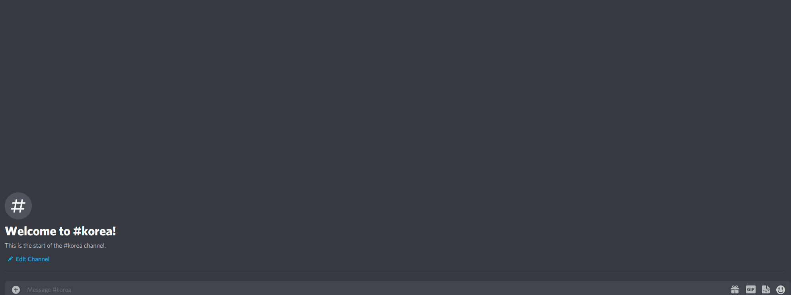
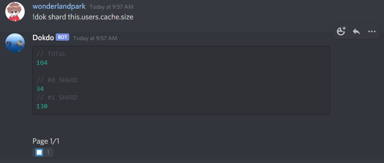

<div align="center">
    
    <br/>
</div>

## About

This is a clone of [wonderlandpark/dokdo](https://github.com/wonderlandpark/dokdo)

Dokdo. Easy Discord bot debugging tool.

It's a debugging tool for `discord.js` projects.

## Preview



### Installation

```sh
npm i Faironic/dokdo-clone#main
```

## Features

### Shell command on stdout update


### Easy shard broadcastEval manager



## Example usage

```js
const { Discord, GatewayIntentBits } = require('discord.js')
const client = new Discord.Client({
  intents: [ 
    GatewayIntentBits.Guilds,
    GatewayIntentBits.GuildMessages,
  ],
})

const Dokdo = require('dokdo')

const DokdoHandler = new Dokdo(client, { owners: ["000000000000", "000000000000"] }) // If the owners are not specified then it will use Bot Application ownerID as default for owner option.

client.on('messageCreate', async message => {
  if ((message.content.startsWith('!dokdo') || (message.content.startsWith('!dok')) {
    DokdoHandler.run(message)
  }
})

client.login('super secret token')
```
